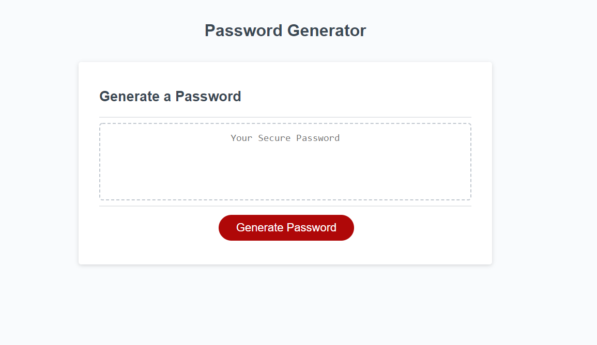
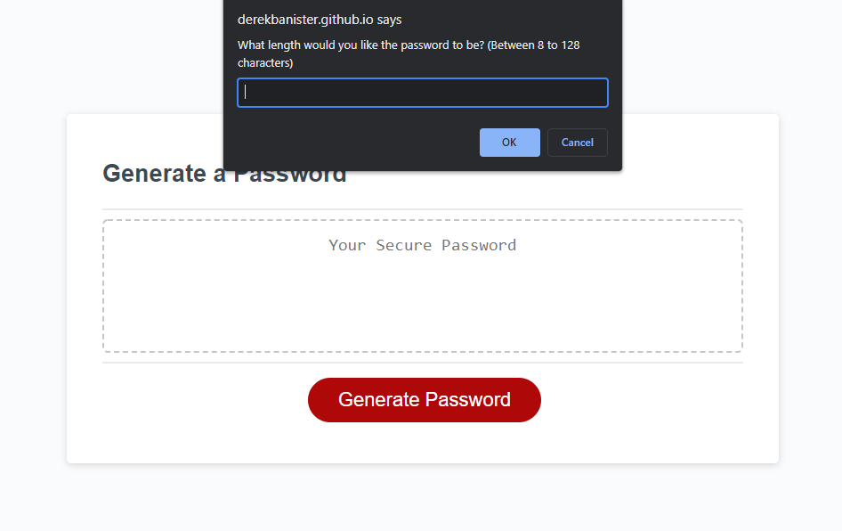
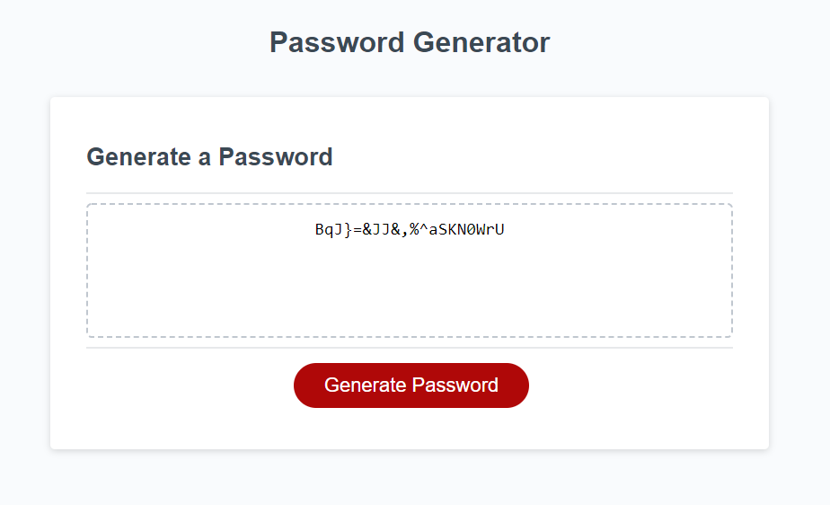

# Password Generator

============================================================================================================================================================

### This project generates a random password for the user based on the criteria they have chosen including upper and lowercase letters, special symbols, and numbers. It then takes all of the user's input and generates that password and displays it into the text area provided.

## Built With

* [HTML](https://developer.mozilla.org/en-US/docs/Web/HTML)
* [CSS](https://developer.mozilla.org/en-US/docs/Web/CSS)
* [Javascript](https://developer.mozilla.org/en-US/docs/Web/JavaScript)

## Deployed Link

* [Generate your very own secure password here!](https://derekbanister.github.io/password-generator/)

## Author
#### Derek Banister

- [Link to Portfolio Site](https://derekbanister.github.io/First-Portfolio/)
- [Link to Github](https://github.com/DerekBanister)
- [Link to LinkedIn](https://www.linkedin.com/in/derek-banister/)
